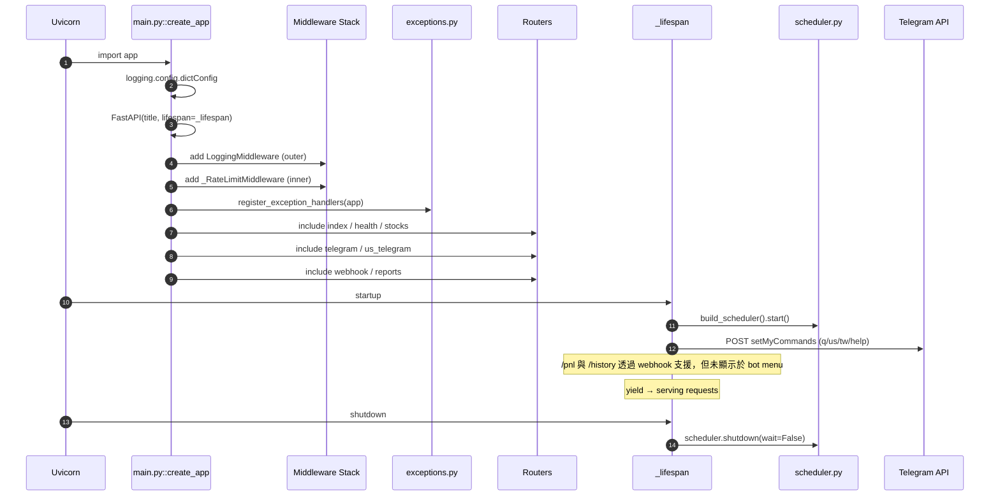
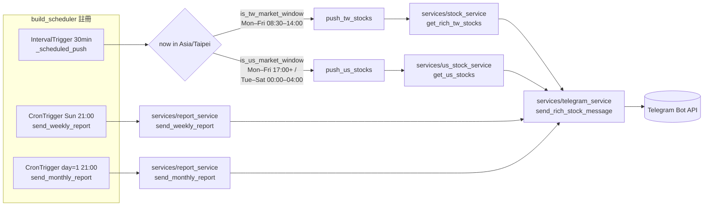
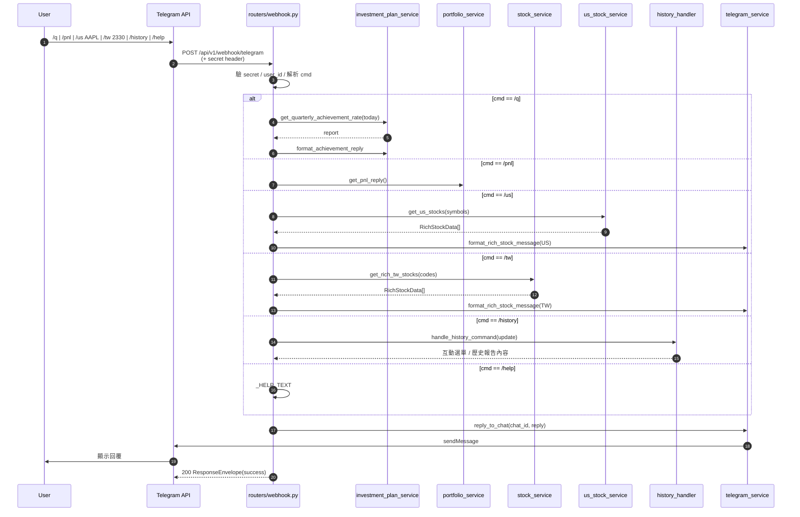
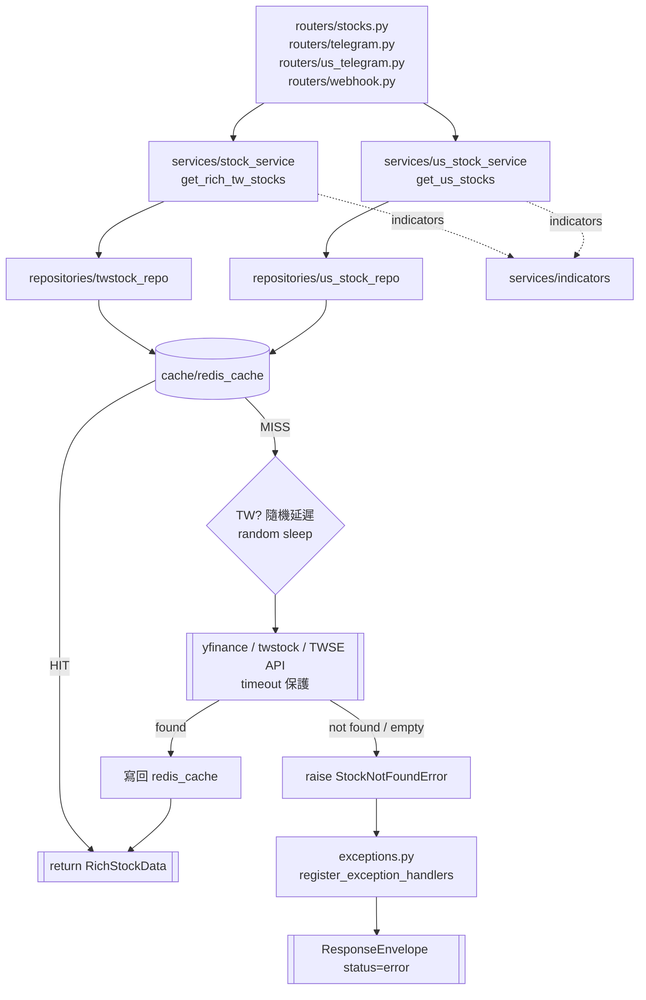
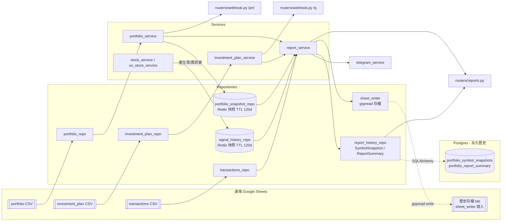
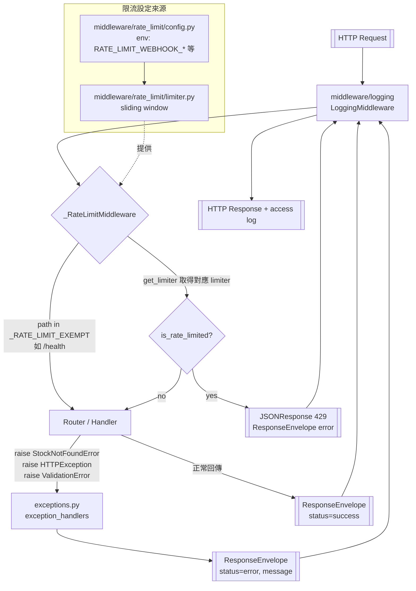

# fastApiStock 專案架構文件

本文件以 Mermaid 圖呈現專案整體分層與主要資料流。圖表可於 GitHub、VSCode (with Mermaid plugin) 或 Obsidian 直接渲染。

---

## 0. 總覽架構圖

採典型三層式分層（Router → Service → Repository），搭配橫向的 `schemas/`（契約）、`cache/`（Redis）、`middleware/`（Logging + Rate Limit）作為跨切面支撐。兩個觸發來源並行：`APScheduler`（主動推播）與 `webhook.py`（Telegram 使用者指令）。外部 I/O 邊界僅限 Repository 層。

```mermaid
flowchart TB
    subgraph EXT["External Dependencies"]
        TG_API[["Telegram Bot API"]]
        YF[["yfinance"]]
        GSHEET[["Google Sheets"]]
        REDIS[("Redis")]
        PG[("Postgres")]
    end

    subgraph ENTRY["Entry / Bootstrap"]
        MAIN["main.py<br/>FastAPI app + lifespan"]
        CFG["config.py"]
        EXC["exceptions.py"]
        SCHED["scheduler.py<br/>APScheduler (TW/US push)"]
    end

    subgraph MW["Middleware Layer"]
        LOGMW["middleware/logging.py"]
        RL["middleware/rate_limit/"]
    end

    subgraph ROUTER["API Layer (routers/)"]
        R_INDEX["index.py"]
        R_HEALTH["health.py"]
        R_STOCKS["stocks.py"]
        R_TW_TG["telegram.py"]
        R_US_TG["us_telegram.py"]
        R_WH["webhook.py<br/>/tw /us /q /pnl /history /help"]
        R_REP["reports.py"]
    end

    subgraph SVC["Service Layer"]
        S_STOCK["stock_service.py"]
        S_US["us_stock_service.py"]
        S_PORT["portfolio_service.py"]
        S_PLAN["investment_plan_service.py"]
        S_REP["report_service.py"]
        S_TG["telegram_service.py"]
        S_IND["indicators.py"]
        S_HIST["history_handler.py"]
    end

    subgraph REPO["Repository Layer"]
        RP_TW["twstock_repo.py<br/>StockNotFoundError"]
        RP_US["us_stock_repo.py"]
        RP_PORT["portfolio_repo.py<br/>PortfolioEntry"]
        RP_PLAN["investment_plan_repo.py"]
        RP_TX["transactions_repo.py"]
        RP_SNAP["portfolio_snapshot_repo.py<br/>Redis 快照"]
        RP_SIG["signal_history_repo.py<br/>Redis 快照"]
        RP_HIST["report_history_repo.py<br/>SymbolSnapshot + ReportSummary"]
        RP_SHEET["sheet_writer.py<br/>gspread 歷史存檔"]
    end

    subgraph SHARED["Shared Contracts"]
        SCH_COMMON["schemas/common.py<br/>ResponseEnvelope"]
        SCH_STOCK["schemas/stock.py<br/>RichStockData"]
        CACHE["cache/redis_cache.py"]
    end

    MAIN --> CFG
    MAIN --> EXC
    MAIN --> LOGMW
    MAIN --> RL
    MAIN --> SCHED
    MAIN -->|include_router| ROUTER

    R_STOCKS --> S_STOCK
    R_STOCKS --> S_US
    R_TW_TG --> S_TG
    R_TW_TG --> S_STOCK
    R_US_TG --> S_TG
    R_US_TG --> S_US
    R_WH --> S_PORT
    R_WH --> S_PLAN
    R_WH --> S_STOCK
    R_WH --> S_US
    R_WH --> S_TG
    R_WH --> RP_PORT
    R_WH --> S_HIST
    R_REP --> S_REP
    R_REP --> RP_HIST

    SCHED --> S_REP
    SCHED --> S_TG
    SCHED --> S_STOCK
    SCHED --> S_US

    S_STOCK --> S_IND
    S_US --> S_IND
    S_PORT --> S_STOCK
    S_REP --> S_TG
    S_REP --> S_IND
    S_REP --> RP_HIST
    S_REP --> RP_SHEET

    S_STOCK --> RP_TW
    S_US --> RP_US
    S_PORT --> RP_PORT
    S_PORT --> RP_TW
    S_PLAN --> RP_PLAN
    S_REP --> RP_SNAP
    S_REP --> RP_SIG
    S_REP --> RP_TX
    S_TG --> RP_SIG

    S_STOCK --> CACHE
    S_US --> CACHE
    S_PORT --> CACHE
    RP_PORT --> CACHE
    RP_PLAN --> CACHE
    S_STOCK --> SCH_STOCK
    S_US --> SCH_STOCK
    S_TG --> SCH_STOCK
    RP_TW --> SCH_STOCK
    RP_US --> SCH_STOCK
    ROUTER --> SCH_COMMON
    EXC --> SCH_COMMON
    EXC --> RP_TW

    RP_TW -. yfinance .-> YF
    RP_US -. yfinance .-> YF
    RP_PORT -. httpx CSV .-> GSHEET
    RP_PLAN -. httpx CSV .-> GSHEET
    RP_TX -. httpx CSV .-> GSHEET
    RP_SHEET -. gspread write .-> GSHEET
    RP_HIST -. SQLAlchemy .-> PG
    CACHE -. redis-py .-> REDIS
    RL -. storage .-> REDIS
    S_TG -. httpx POST .-> TG_API
    TG_API -. webhook POST .-> R_WH

    classDef entry fill:#fde9a9,stroke:#b58900,color:#222
    classDef router fill:#c6e2ff,stroke:#268bd2,color:#073642
    classDef svc fill:#d5f5d5,stroke:#2aa198,color:#073642
    classDef repo fill:#f5d5d5,stroke:#dc322f,color:#073642
    classDef shared fill:#e8d5f5,stroke:#6c71c4,color:#073642
    classDef ext fill:#eeeeee,stroke:#555,color:#111
    classDef mw fill:#ffe4b5,stroke:#cb4b16,color:#073642

    class MAIN,CFG,EXC,SCHED entry
    class R_INDEX,R_HEALTH,R_STOCKS,R_TW_TG,R_US_TG,R_WH,R_REP router
    class S_STOCK,S_US,S_PORT,S_PLAN,S_REP,S_TG,S_IND,S_HIST svc
    class RP_TW,RP_US,RP_PORT,RP_PLAN,RP_TX,RP_SNAP,RP_SIG,RP_HIST,RP_SHEET repo
    class SCH_COMMON,SCH_STOCK,CACHE shared
    class TG_API,YF,GSHEET,REDIS,PG ext
    class LOGMW,RL mw
```



### 核心抽象速查

| 元件 | 位置 | 角色 |
|---|---|---|
| `ResponseEnvelope` | `schemas/common.py` | 所有 API 回應外殼 |
| `RichStockData` | `schemas/stock.py` | 跨層股票資料合約 |
| `StockNotFoundError` | `repositories/twstock_repo.py` | 全域 404 觸發點 |
| `PortfolioEntry` | `repositories/portfolio_repo.py` | 不可變持倉列 |
| `redis_cache.get/put` | `cache/redis_cache.py` | 共用快取入口 |
| `ReportSummary` | `repositories/report_history_repo.py` | 月報彙總資料合約 |
| `SymbolSnapshot` | `repositories/report_history_repo.py` | 個股月度快照資料合約 |

---

## 1. Entry & Bootstrap 啟動流程圖

`main.py::create_app()` 透過 `_lifespan` context manager 管理應用生命週期。啟動順序：logging config → FastAPI 實例 → middleware（Logging 外層、RateLimit 內層）→ exception handlers → include routers → APScheduler 啟動 → setMyCommands。



---

## 2. APScheduler 排程觸發流程圖

`scheduler.py::build_scheduler()` 註冊三個 job：30 分鐘 interval 的 `_scheduled_push`（依時段分流 TW/US），以及每週日 21:00、每月 1 日 21:00 的 cron report。時段由 `is_tw_market_window` / `is_us_market_window` 以 Asia/Taipei 判定。



---

## 3. Telegram Webhook 指令流程圖

`POST /api/v1/webhook/telegram` 會先驗 `X-Telegram-Bot-Api-Secret-Token` 與授權 user id，再由 `_parse_command` 分派 handler，最後透過 `reply_to_chat` 回推訊息。未授權或未知指令一律回 200 避免 Telegram 重試。



---

## 4. Stock 資料讀取流程圖（TW + US 共用）

TW/US 共用「Service → Repository → redis_cache → yfinance」鏈。cache miss 時台股端會加隨機延遲，查無股票拋 `StockNotFoundError`，由 exception handler 轉成友善訊息。



---

## 5. Portfolio / Investment Plan / Report History 資料流圖

三個 Google Sheets CSV 提供來源資料。`portfolio_snapshot_repo` 與 `signal_history_repo` 以 **Redis** 存短期快照（TTL 120 天）；`report_history_repo` 以 **Postgres** 存永久月度歷史記錄；`sheet_writer` 以 gspread 將報告回寫至 Google Sheets 歷史 tab。`report_service` 是最大的 fan-in 節點。



---

## 6. Middleware / Cross-cutting 圖

`LoggingMiddleware` 為最外層；`_RateLimitMiddleware` 為內層並以 `get_limiter(path)` 取得 per-route 限流器，`/health` 為豁免路徑。業務例外透過 `register_exception_handlers` 統一轉為 `ResponseEnvelope`。



---

## 7. REST API 端點總覽

所有路由皆回傳 `ResponseEnvelope`，需授權的端點以 `Authorization: Bearer {ADMIN_TOKEN}` header 驗證。

### 股票查詢

| 方法 | 路徑 | 說明 |
|---|---|---|
| `GET` | `/api/v1/stocks/{code}` | 查詢單支股票（TW / US 自動判斷） |
| `GET` | `/api/v1/telegram/tw` | 批次查台股（逗號分隔代碼） |
| `GET` | `/api/v1/telegram/us` | 批次查美股（逗號分隔代碼） |

### Telegram Webhook

| 方法 | 路徑 | 說明 |
|---|---|---|
| `POST` | `/api/v1/webhook/telegram` | 接收 Telegram update，處理 `/q /pnl /us /tw /history /help` |

### 報告 API（`routers/reports.py`）

| 方法 | 路徑 | 說明 | 授權 |
|---|---|---|---|
| `GET` | `/api/v1/reports/weekly/preview` | 渲染週報文字（不發送） | 否 |
| `GET` | `/api/v1/reports/monthly/preview` | 渲染月報文字（不發送） | 否 |
| `POST` | `/api/v1/reports/weekly/send` | 手動發送週報至 Telegram | 是 |
| `POST` | `/api/v1/reports/monthly/send` | 手動發送月報至 Telegram | 是 |
| `POST` | `/api/v1/reports/history/trigger` | 手動觸發報告歷史管線（支援 `dry_run` / `skip_telegram` / `skip_sheet`） | 是 |
| `GET` | `/api/v1/reports/history` | 查詢月度歷史記錄（per-symbol 時間序列 / 單市場摘要 / 雙市場摘要） | 否 |
| `GET` | `/api/v1/reports/history/options` | 取得查詢選擇器 metadata（市場 / 代碼 / 期間） | 否 |

### 系統

| 方法 | 路徑 | 說明 |
|---|---|---|
| `GET` | `/health` | 健康檢查（rate-limit 豁免） |
| `GET` | `/` | 服務資訊 |

---

## 附錄 A：CLI 管理腳本

`scripts/backfill_history.py` 為獨立的批次管理工具，不屬於執行時服務，用於回溯填充月度歷史至 Postgres 與 Google Sheets。

```
uv run python -m fastapistock.scripts.backfill_history [options]
```

| 選項 | 說明 |
|---|---|
| `--markets TW\|US\|BOTH` | 指定市場（預設 BOTH） |
| `--from YYYY-MM` | 起始月份（預設最早交易月） |
| `--to YYYY-MM` | 結束月份（預設上個月） |
| `--repair-deltas` | 從 DB 重算所有月份的 `pnl_*_delta`（與 `--from/--to` 互斥） |
| `--dry-run` | 試跑，不寫入 DB / Sheet / Redis |
| `--skip-sheet` | 跳過 Google Sheets 寫入（避免重複 append） |
| `--verbose` | 開啟 DEBUG 日誌 |

**注意**：每次 backfill 完成後會同步寫入 Redis monthly snapshot，確保後續 cron job 的 delta 基準與 DB 一致。

---

## 附錄 B：API 文件（OpenAPI / Swagger）

FastAPI 內建 OpenAPI 3 支援，無需額外套件。啟動 `uvicorn fastapistock.main:app` 後可直接使用：

| 端點 | 用途 |
|---|---|
| `/docs` | Swagger UI（互動式，可 Try it out） |
| `/redoc` | ReDoc（更適合閱讀的文件樣式） |
| `/openapi.json` | 原始 OpenAPI spec |

與 .NET 對比：Swashbuckle 需 `AddSwaggerGen` + XML comments、NSwag 要跑 tool；FastAPI 是**型別即 schema**，Pydantic model 直接推出文件，完全不用 attribute 或額外 pipeline。

進階需求對應套件：
- `openapi-python-client` / `fastapi-code-generator`：從 spec 產生 client SDK
- `Scalar` / `Redocly`：更現代化的 UI
- `mkdocs` + OpenAPI plugin：匯出 static HTML 文件站
