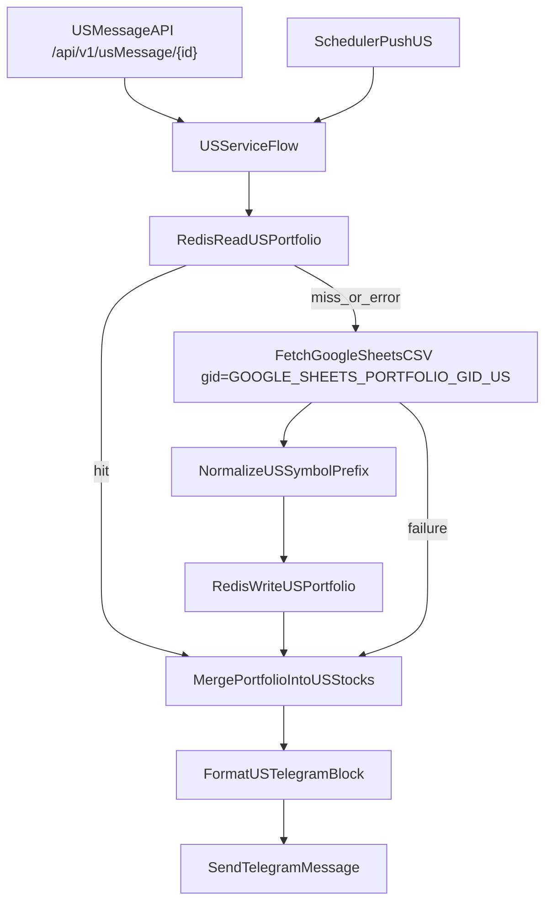

# Implementation Plan: US Portfolio Sheets Integration

**Branch**: `002-us-portfolio-sheets` | **Date**: 2026-04-09 | **Spec**: [spec.md](spec.md)
**Input**: Feature specification from `/specs/002-us-portfolio-sheets/spec.md`

## Summary

Implement US portfolio enrichment for Telegram pushes using a dedicated US API route and existing US scheduler flow.

- API path (manual trigger): `GET /api/v1/usMessage/{id}`
- Scheduler path (automatic trigger): `push_us_stocks()`
- US portfolio source: same Google Sheet ID with dedicated env var `GOOGLE_SHEETS_PORTFOLIO_GID_US` (example: `320283463`)
- US fields: `A=symbol_with_prefix`, `G=avg_cost`, `H=unrealized_pnl`
- Cache/fallback policy: Redis-first, graceful degradation on Redis/Sheets failures

## Technical Context

**Language/Version**: Python 3.11
**Primary Dependencies**: FastAPI, APScheduler, httpx, redis-py, csv (stdlib)
**New Dependencies**: none
**Storage**: Redis (US portfolio cache + existing stock caches)
**Testing**: pytest + fakeredis + unittest.mock
**Target Platform**: Linux/Railway
**Project Type**: FastAPI web service
**Performance Goals**:

- cache-hit portfolio enrichment < 10 ms
- explicit Sheets timeout; no unbounded waits

**Constraints**:

- Redis-only cache layer for this feature
- config-driven operational values
- structured REQ/RES/PERF logging remains consistent with middleware

**Scale/Scope**:

- single account to small multi-symbol pushes (`AAPL,TSLA,...`)

## Constitution Check

| Principle | Status | Compliance Strategy |
|-----------|--------|---------------------|
| I. Code Quality | PASS | typed functions, env/config-driven values, no hardcoded runtime constants in business logic |
| II. Testing Standards | PASS | parser/normalizer/cache/fallback/formatter tests included |
| III. API Consistency | PASS | keep dedicated US route + standard response envelope |
| IV. Performance & Resilience | PASS | Redis-first cache, timeout, graceful fallback when dependency fails |
| V. Observability | PASS | existing logging middleware covers REQ/RES/PERF; service-level cache/fallback logs added |

## Current Project References (must stay true)

- US API route: [`src/fastapistock/routers/us_telegram.py`](../../src/fastapistock/routers/us_telegram.py)
- App router registration + lifespan scheduler wiring: [`src/fastapistock/main.py`](../../src/fastapistock/main.py)
- Scheduler with US push path: [`src/fastapistock/scheduler.py`](../../src/fastapistock/scheduler.py)
- US stock business flow: [`src/fastapistock/services/us_stock_service.py`](../../src/fastapistock/services/us_stock_service.py)
- US repository flow: [`src/fastapistock/repositories/us_stock_repo.py`](../../src/fastapistock/repositories/us_stock_repo.py)
- Telegram formatting: [`src/fastapistock/services/telegram_service.py`](../../src/fastapistock/services/telegram_service.py)

## Project Structure

### Documentation (this feature)

```text
specs/002-us-portfolio-sheets/
├── spec.md
└── plan.md
```

### Source Code Impact (planned)

```text
src/fastapistock/
├── config.py                         # US portfolio gid/ttl/timeout config
├── repositories/portfolio_repo.py    # US portfolio fetch + symbol normalization
├── services/us_stock_service.py      # merge US portfolio data into US stocks
├── services/telegram_service.py      # render US portfolio block when available
├── routers/us_telegram.py            # keep dedicated US API contract
├── scheduler.py                      # keep US scheduled path (push_us_stocks)
└── middleware/logging.py             # existing REQ/RES/PERF format remains source of truth

tests/
├── test_portfolio_repo.py
├── test_us_stock_service.py
├── test_telegram_formatter.py
└── test_scheduler.py
```

## API/Scheduler Split (explicit)

- **TW manual API**: `/api/v1/tgMessage/{id}`
- **US manual API**: `/api/v1/usMessage/{id}` (separate route, separate parsing rules)
- **TW scheduled path**: `push_tw_stocks()`
- **US scheduled path**: `push_us_stocks()`

No endpoint unification is introduced in this feature.

## Data Flow



## Implementation Phases

### Phase 1: Config and Contract

- Add/confirm US-specific config keys for:
  - sheet ID reuse
  - TW gid (`GOOGLE_SHEETS_PORTFOLIO_GID_TW`)
  - US gid (`GOOGLE_SHEETS_PORTFOLIO_GID_US`, example `320283463`)
  - portfolio cache TTL
  - Sheets timeout
- Document config in contract docs (if generated later in this feature track).

### Phase 2: US Portfolio Fetch + Normalize

- Extend portfolio repository read path for US columns (`A/G/H`).
- Implement prefix stripping normalization:
  - `US_AAPL -> AAPL`
  - `NASDAQ:AAPL -> AAPL`
- Skip malformed rows safely.

### Phase 3: Service Merge + Render

- Merge normalized US portfolio snapshot into US rich stock objects.
- Render portfolio block in US message only when entry exists.

### Phase 4: Scheduler Verification

- Keep using `push_us_stocks()` path.
- Ensure scheduler behavior remains independent from TW path and does not regress.

### Phase 5: Tests and Quality Gates

- Repository tests: parse, normalize, failure fallback.
- Service/formatter tests: merge + conditional display.
- Scheduler tests: US path still wired and callable.
- Lint/type/test suite: `ruff`, `mypy`, `pytest`.

## Risks and Mitigations

- **Symbol collision/normalization bugs**
  Mitigation: deterministic normalization and unit tests for multiple prefix formats.

- **Dependency instability (Sheets/Redis)**
  Mitigation: explicit timeout + graceful fallback + warning/error logs.

- **API/scheduler coupling regressions**
  Mitigation: keep dedicated US route and dedicated scheduler function; add tests for both paths.

## Notes

- This plan defines architecture and execution path only; it does not modify the external API envelope.
- This feature intentionally preserves separate US and TW operational flows.
